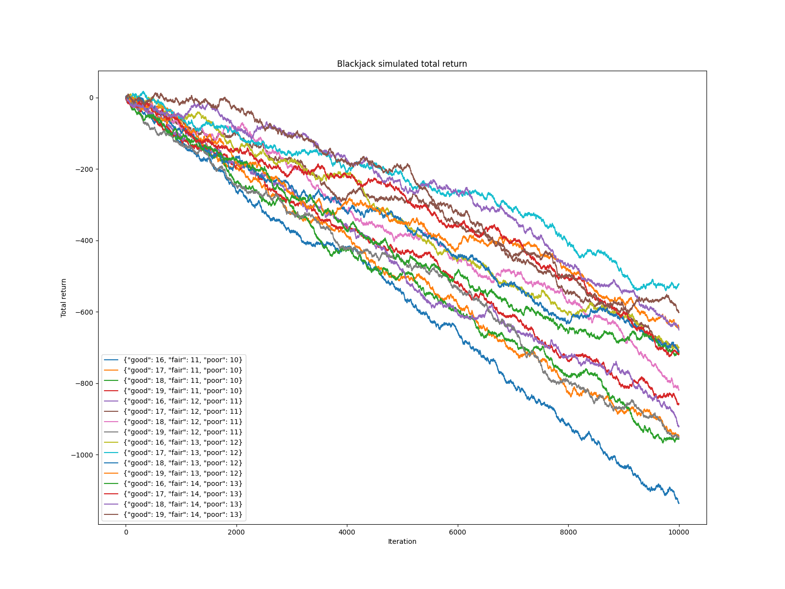
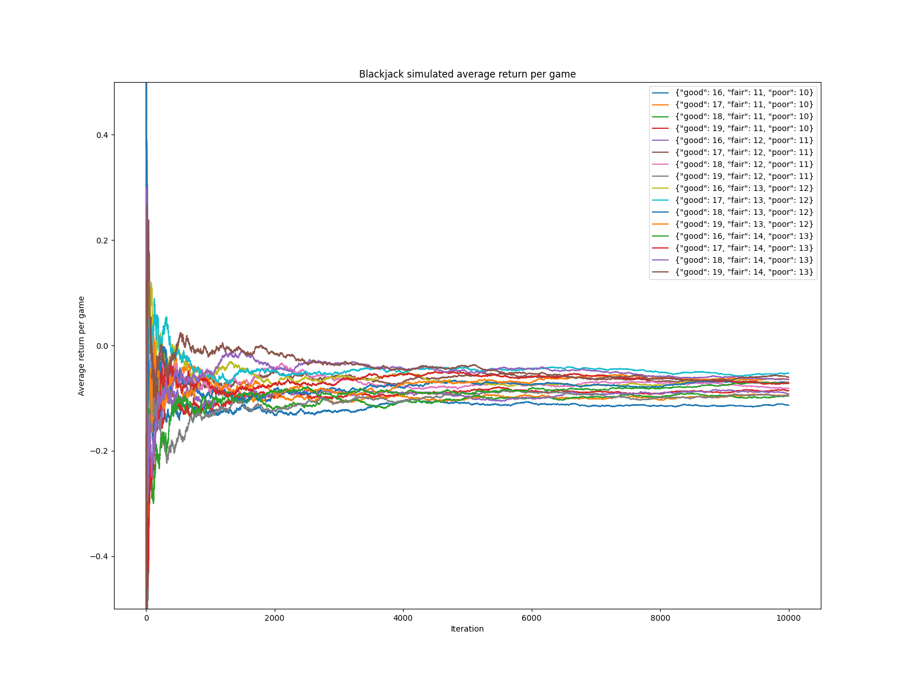

# Blackjack simulation report

**Student**: Andrei Goncharov (agoncharov6@gatech,edu)

## Problem statement

Implement a blackjack simulation. Implement a basic strategy (described below). Research how to tune the basic strategy to optimize profit.

## Basic strategy

> Taken from ref. #1

Winning tactics in Blackjack require that the player play each hand in the optimum way, and such strategy always takes into account what the dealer's upcard is. When the dealer's upcard is a good one, a 7, 8, 9, 10-card, or ace for example, the player should not stop drawing until a total of 17 or more is reached. When the dealer's upcard is a poor one, 4, 5, or 6, the player should stop drawing as soon as he gets a total of 12 or higher. The strategy here is never to take a card if there is any chance of going bust. The desire with this poor holding is to let the dealer hit and hopefully go over 21. Finally, when the dealer's up card is a fair one, 2 or 3, the player should stop with a total of 13 or higher.

With a soft hand, the general strategy is to keep hitting until a total of at least 18 is reached. Thus, with an ace and a six (7 or 17), the player would not stop at 17, but would hit.

The basic strategy for doubling down is as follows: With a total of 11, the player should always double down. With a total of 10, he should double down unless the dealer shows a ten-card or an ace. With a total of 9, the player should double down only if the dealer's card is fair or poor (2 through 6).

## Algorithm

As we can see, the basic strategy can be described as a set of thresholds that player needs to match based on the dealer's card type. For example, the strategy defined above outlines the following set: "good" upcard - 17, "fair" upcard - 13, "poor" upcard - 12.

Basic algorithm can be formalized as the following:
1. Identify dealer's card type
2. Find a matching threshold
3. "Hit" until the threshold is met

If we include "doubling", the algorithm can be extended as the following:
1. Identify dealer's card type
2. Check if we need to "double"
3. Find a matching threshold
4. "Hit" until the threshold is met

## Objective

1. Identify a list of threshold sets ("candidates"). Run simulation for each one of them. Calculate average return. Identify the best set ("winner").

## Implementation considerations

1. The main benefit of a full-blown simulation framework with a process-interaction world view is its that it manages the "world clock" for us. However, blackjack is not time-bound. We use plain python to run the basic strategy with different thresholds and collect the results. We might consider using a simulation framework if we ever need to add some sort of a time-bound process. For example, in the future, we might try simulating "card-counting", and we might want to simulate a player getting tired and making mistakes over time.
2. We run 10000 games for each set of thresholds.
3. Player bets `1` credit.

## Results

| Thresholds set | Total return after 10000 games (credits) | Average return per game (credits) |
|----------------|------------------------------------------|-----------------------------------|
| {'good': 16, 'fair': 11, 'poor': 10} | -1136.0 | -0.11 |
| {'good': 17, 'fair': 11, 'poor': 10} | -948.0 | -0.09 |
| {'good': 18, 'fair': 11, 'poor': 10} | -956.5 | -0.10 |
| {'good': 19, 'fair': 11, 'poor': 10} | -856.5 | -0.09 |
| {'good': 16, 'fair': 12, 'poor': 11} | -920.0 | -0.09 |
| {'good': 17, 'fair': 12, 'poor': 11} | -710.5 | -0.07 |
| {'good': 18, 'fair': 12, 'poor': 11} | -819.0 | -0.08 |
| {'good': 19, 'fair': 12, 'poor': 11} | -953.0 | -0.10 |
| {'good': 16, 'fair': 13, 'poor': 12} | -699.5 | -0.07 |
| {'good': 17, 'fair': 13, 'poor': 12} | -523.0 | -0.05 |
| {'good': 18, 'fair': 13, 'poor': 12} | -709.5 | -0.07 |
| {'good': 19, 'fair': 13, 'poor': 12} | -644.5 | -0.06 |
| {'good': 16, 'fair': 14, 'poor': 13} | -714.5 | -0.07 |
| {'good': 17, 'fair': 14, 'poor': 13} | -718.0 | -0.07 |
| {'good': 18, 'fair': 14, 'poor': 13} | -651.0 | -0.07 |
| {'good': 19, 'fair': 14, 'poor': 13} | -602.0 | -0.06 |

## Summary
The best player's return (-523.0 credits total for 10000 games, -0.05 credits average per game) is observed with the thresholds {'good': 17, 'fair': 13, 'poor': 12}. It is in-line with the predicted by the strategy result.

## References

1. https://bicyclecards.com/how-to-play/blackjack/
2. https://en.wikipedia.org/wiki/Blackjack

